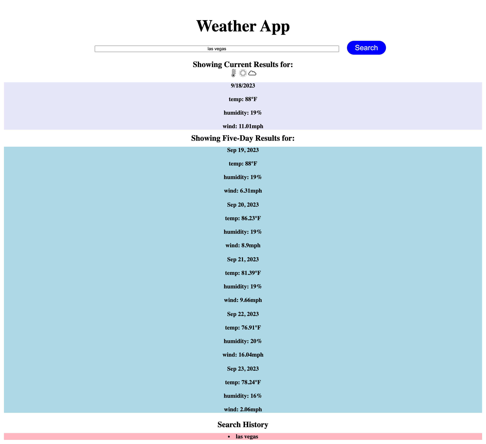

# weather-app-challenge-6

## 

## Description
Allows users to search a city's current weather and projected five-day weather forecast. Provides a list of previous searches and makes them available to be searched again. This application displays information about a city's temperature, humidity, and wind speeds, as well as the date. Icons are used to represent temperature, humidity, and wind speeds.

## Visuals

(https://ntmartinez18.github.io/weather-app-challenge-6/)

## Technologies
* html
* css
* javascript

## Installation
N/A

## Usage
To use this application, type a city in the search bar and click the "search" button. A list of weather information will be displayed under the "Showing Current Results for" section that displays the current weather conditions of that city. Weather conditions include city temperature, humidity, and wind speed. Under the "Showing Five-Day Results for" the user will see the five day weather forecast displayed every three hours of that day. Search history will be stored so a user can then click on their previous search and results will be displayed again.

## Credits
Thanks to Eric Sayers for his help and guidance with this project as well as the Xpert Learning Assistant tool and openWeather API.

## License
MIT